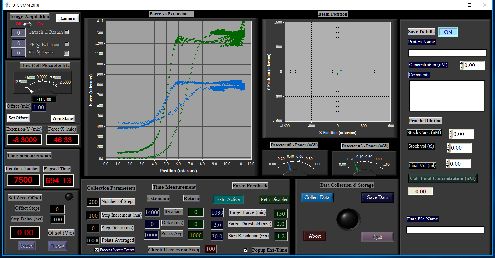
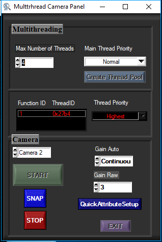
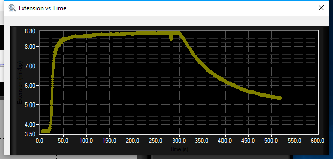
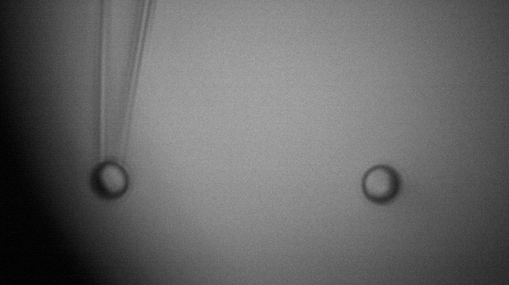

# UTC
----Universal Tweezers Controller----
A LabWindows based data acquisition program for optical tweezers. The programs drives an npoint nanopositioner using pulse frequency modulation,
digitally acquire piezo position using a differential quadrature encoder, while  reading (NI DAQMX - AI) the deflections of two counter propogating lasers
registerend in seperate quadrant PIN photdiodes (QP). In addition the program utlizies multi-threading capabilities to drive two cameras to
acquire simultaneous image information.
## GUI
Screen shots of the UTC panels during a DNA intercaation experiment
### Main Panel

#### The figure shows a screen shot during a DNA intercalation experiment. The Main control panel is used to setup all the data acquisition parameters such as extension-step sizes , delay between each steps, force-clamp information. In addition the image acquisition model can be used to set up the image capturing frequency. Force-clamp experiments can be manipulated real-time to switch between forces. Before saving the data acquired, the user can imput information about an experimental run on the ‘save details’ module (right) such as, the protein type and concentration and comments, that will automatically be saved along with all the data acquisition parameters, as supplemental detail information for a given run. 
### Camera Panel

#### The cameral controller allows the user to configure nulti-treading prioriy parameters and switch beween the two cameras.   
### CameraView

#### Extension and time are plotted in y and x axis, respectively. The snapshot shown here was taken during an experiment with DNA intercalators. This simple and newest addition continuosly displays the extension as a function of time during force-clamped experiments. Extension-time infomration updates the user on the current kinetic state and thereby allowing to manipulate parameters during the data acquisition.
### CameraView

The significant improvements in the new software includes the digital control of the piezo stage, and the image acquisition capabilities achieved with multi-threading techniques. The software drives a piezo electric stage (nPoint) using pulse frequency modulation and interprets the piezo position using a differential quadrature encoder. Digitally interfacing the piezo electric stage improved the spatial resolution of the optical tweezers from 0.8 nm to 0.1 nm.  In addition, simultaneous image capturing allowed us to correct for the long-term thermal drifts, which in turn made it possible to precisely capture subtle extension-changes involved in protein-DNA interactions. UTC contains 4 panels; the main controller, extension-time, camera controller, and camera view. The main controller (Fig. A1) allows the user to configure an experimental run while displaying real-time data acquisition information such as piezo position and laser deflection. The extension-time panel displays the real-time extension of the tethered DNA as a function of time. The camera-control panel allows the user to switch between the two cameras and control the camera attributes, such as gain. And the camera view panel displays the field of view of the flow-cell channel. The software utilized multi-threading capabilities to drive the camera in a separate thread to ensure that the image acquisition is independent from the rest of the modules. The user can choose to acquire images simultaneously with stage-position and laser deflection data, at a desired frequency. The metadata of the acquired images are stored in the raw data file with time-stamps, which allows us to compare extension information acquired from the stage and the images. 

