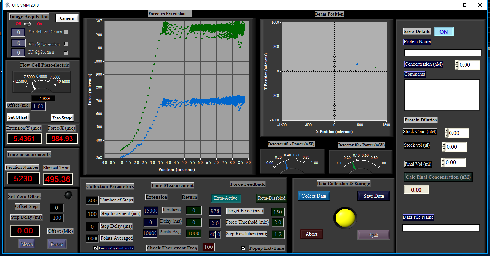

# UTC
----Universal Tweezers Controller----
A LabWindows based data acquisition program for optical tweezers. The programs drives an npoint nanopositioner using pulse frequency modulation,
digitally acquire piezo position using a differential quadrature encoder, while  reading (NI DAQMX - AI) the deflections of two counter propogating lasers
registerend in seperate quadrant PIN photdiodes (QP). In addition the program utlizies multi-threading capabilities to drive two cameras to
acquire simultaneous image information.
## GUI
Screen shots of the UTC panels during a DNA intercaation experiment
### Main Panel

### Camera Panel

### CameraView

### CameraView

The significant improvements in the new software includes the digital control of the piezo stage, and the image acquisition capabilities achieved with multi-threading techniques. The software drives a piezo electric stage (nPoint) using pulse frequency modulation and interprets the piezo position using a differential quadrature encoder. Digitally interfacing the piezo electric stage improved the spatial resolution of the optical tweezers from 0.8 nm to 0.1 nm.  In addition, simultaneous image capturing allowed us to correct for the long-term thermal drifts, which in turn made it possible to precisely capture subtle extension-changes involved in protein-DNA interactions. UTC contains 4 panels; the main controller, extension-time, camera controller, and camera view. The main controller (Fig. A1) allows the user to configure an experimental run while displaying real-time data acquisition information such as piezo position and laser deflection. The extension-time panel displays the real-time extension of the tethered DNA as a function of time. The camera-control panel allows the user to switch between the two cameras and control the camera attributes, such as gain. And the camera view panel displays the field of view of the flow-cell channel. The software utilized multi-threading capabilities to drive the camera in a separate thread to ensure that the image acquisition is independent from the rest of the modules. The user can choose to acquire images simultaneously with stage-position and laser deflection data, at a desired frequency. The metadata of the acquired images are stored in the raw data file with time-stamps, which allows us to compare extension information acquired from the stage and the images. 

